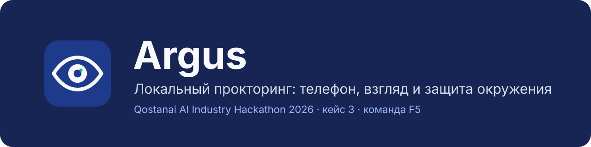

<p align="center"></p>

# Argus — локальный прокторинг

Qostanai AI Industry Hackathon 2026, кейс 3 «Локальный прокторинг», команда F5.

Argus — приложение для Windows, которое во время онлайн-теста одновременно следит
за камерой и за самой системой. Всё работает на компьютере студента: без сервера,
без интернета во время теста, видео не сохраняется и никуда не передаётся.
Система никого не обвиняет: она фиксирует события с кадрами и показывает
преподавателю, что произошло, а решение принимает он.

| Что закрывает | Как |
| --- | --- |
| Телефон в кадре и наведение на экран | YOLOv8s находит, CLIP перепроверяет; событие после 2 попаданий из 5 |
| Взгляд вниз и в стороны, отсутствие и второе лицо | MediaPipe Face Mesh: поворот и наклон головы, зрачки; в сторону 2 с, вниз 3 с |
| Alt+Tab, Alt+F4, Win, PrtScn, Ctrl+C/V | Перехват сочетаний, окно теста на весь экран и поверх остальных |
| Удалённый помощник (AnyDesk, Parsec, RDP и др.) | Окно скрыто от захвата экрана; фиксируются удалённая сессия, удалённый ввод, запрещённые программы и второй монитор |
| Фото экрана телефоном | Водяной знак с ФИО, номером сессии и временем |
| Разбор результатов | Панель преподавателя: правила корреляции событий, кадры, решение, отчёт одним HTML-файлом |

Две роли, два запуска: `python main.py` — тест студента, `python -m teacher` —
панель преподавателя.

## Быстрый старт

Нужны Windows 10 (2004) или новее, 64-разрядный Python 3.11 (3.12 тоже
работает), веб-камера и интернет **только при первом запуске**, чтобы скачать
веса YOLO и CLIP.

```powershell
git clone https://github.com/champaldi/Argus-Proctoring.git
cd Argus-Proctoring
py -3.11 -m venv .venv
.venv\Scripts\Activate.ps1
python -m pip install -r requirements.txt
python main.py
```

Если PowerShell не даёт активировать окружение, выполните один раз
`Set-ExecutionPolicy -Scope CurrentUser RemoteSigned` или запускайте
`.venv\Scripts\python.exe main.py` без активации.

После первого запуска модели лежат в локальном кэше (`yolov8s.pt` в папке
`detection/`, CLIP — в кэше Hugging Face пользователя), и дальше интернет не нужен.

## Как пользоваться

### 1. Студент проходит тест

```powershell
python main.py
```

1. В стартовом окне студент вводит ФИО или ID и подтверждает согласие на
   прокторинг. До этого камера и защита не включаются.
2. Окно теста открывается на весь экран с проверкой перед тестом: защита,
   модели, камера. Пока модели загружаются, а камера не показала первый кадр,
   кнопка «Начать тест» недоступна. Если камера не открылась, тест не начнётся.
   Наблюдение уже идёт: события на этом экране тоже попадают в журнал.
3. После «Начать тест» открываются вопросы с водяным знаком. Справа превью
   камеры, статусы модулей, уровень риска и лента событий (в этой
   демонстрационной сборке студент видит их, чтобы работа системы была
   наглядной).
4. Во время теста заблокированы Alt+Tab, Alt+F4, Win, PrtScn, Ctrl+C/V/X;
   окно скрыто от записи экрана, буфер обмена очищается.
5. После последнего вопроса открывается окно итогов с событиями и кадрами.

**Аварийный выход:** `Ctrl+Alt+F12` сразу снимает все блокировки, но записывается
в журнал как нарушение «Защита отключена вручную» (правило V7). Закрытие
окна и завершение теста тоже снимают защиту.

### 2. Преподаватель смотрит результаты

```powershell
python -m teacher
```

Панель читает ту же базу сессий. Для каждой сессии: имя студента и контрольный
кадр, снятый через пару секунд после включения камеры (лицо сверяет
преподаватель, распознавание лиц не используется), уровень
риска (максимум за сессию), заключение по правилам V1–V7 / S1–S9, таймлайн
событий с кадрами. Событие можно отметить ложным, сессии — вынести решение и
комментарий.

**Отчёт:** кнопка «Сохранить отчёт» открывает окно «Сохранить как» — вы сами
выбираете папку. Имя по умолчанию: `Отчёт <ФИО> <дата время>.html`. Файл
содержит кадры внутри себя, открывается в любом браузере и печатается в PDF.

Учебные сессии без камеры: `python -m teacher.seed_demo`, затем
`python -m teacher --demo`. Подробнее — [teacher/README.md](teacher/README.md).

### 3. Где лежат данные

| Что | Где |
| --- | --- |
| Сессии и события | `data/proctoring.db` (SQLite) |
| Кадры нарушений | `data/screenshots/<id сессии>/` |
| Решения и комментарии преподавателя | `teacher/state/reviews.db` |
| HTML-отчёт | куда сохранил преподаватель |

Папку `data` можно сменить переменной `PROCTOR_DATA_DIR`, например чтобы
начать с чистой базы для демонстрации:

```powershell
$env:PROCTOR_DATA_DIR = "data_demo"
python main.py
python -m teacher   # в том же окне PowerShell — читает data_demo
```

### 4. Запись видеодемонстрации

Защита скрывает окно теста от программ записи (OBS, Discord, Xbox Game Bar
покажут чёрный прямоугольник), а Win и PrtScn во время теста заблокированы.
Для записи демо:

```powershell
$env:PROCTOR_ALLOW_SCREEN_CAPTURE = "1"
python main.py
```

Запись в OBS нужно запустить **до** начала теста. В рабочем режиме
переменную не задавать. Для скриншотов без блокировок можно временно
отключить защиту целиком: `$env:PROCTOR_SECURITY_MODULE = "none"`.

## Архитектура

```
камера ─► CameraWorker (ui/main_window.py) ─► кадр BGR
                                         ├─► detection.phone_detector  (YOLOv8s + CLIP)
                                         └─► gaze                      (MediaPipe Face Mesh)
environment_protection ─► события системы ─┐
                                          ▼
                  core/pipeline.py ─► core/storage.py (SQLite + кадры) ─► core/risk.py
                                          ▼
                       окно теста, окно итогов, панель преподавателя (teacher/)
```

- `main.py` — точка запуска теста;
- `ui/main_window.py` — окно теста, `CameraWorker` (камера и анализ в одном
  фоновом потоке), окно итогов;
- `ui/student_start.py` — стартовое окно с ФИО и согласием;
- `ui/watermark.py`, `core/watermark.py` — водяной знак;
- `ui/theme.py`, `ui/fonts/` — тема и шрифт Inter;
- `core/detectors.py` — подключение модулей детекции;
- `core/pipeline.py` — очередь, эпизоды и запись событий;
- `core/storage.py` — SQLite и снимки нарушений;
- `core/risk.py` — уровень риска 0–100;
- `core/event_presentation.py` — названия событий и сведения о приложениях;
- `detection/` — телефон: YOLOv8s, CLIP-проверка, наведение на экран;
- `gaze/` — лицо, голова, взгляд, число лиц, расстояние до камеры;
- `environment_protection/` — блокировки, окно, процессы, RDP, мониторы, ввод;
- `teacher/` — панель преподавателя, правила корреляции, отчёт;
- `events.py` — общий контракт событий;
- `tools/benchmark_fps.py` — замер скорости анализа.

Камеру открывает только `CameraWorker`; оба анализатора получают от него один
и тот же кадр, и именно он прикладывается к событию.

## Контракт событий

Детектор возвращает список объектов `ProctorEvent`, строк или словарей:

```python
from events import EventType, ProctorEvent

def detect(frame):
    return [
        ProctorEvent.create(
            EventType.PHONE_DETECTED,
            source="yolo",
            confidence=0.91,
            details={"bbox": [100, 80, 220, 310], "phone_count": 1},
        )
    ]
```

```python
return [{"type": "gaze_side", "duration": 3.2, "face_count": 1}]
```

Поддерживаемые значения находятся в `EventType`. Событие создаётся один раз за
непрерывный эпизод и снова учитывается только после прекращения и нового начала
нарушения.

## Модули

**Телефон** — `detection.phone_detector.detect(frame)`. Модель `yolov8s.pt`
запускается на каждом третьем кадре анализа, найденные рамки дополнительно
проверяет CLIP. Событие создаётся после 2 попаданий из 5 запусков модели
(`APP_PHONE_MIN_HITS`). Телефон в верхней части кадра или крупный (поднесён
к камере) фиксируется как «наведён на экран». На слабом ноутбуке можно заменить
`MODEL_NAME` на `"yolov8n.pt"`.

**Взгляд** — `gaze.analyze(frame)`: `mediapipe==0.10.21`, Face Mesh с
радужками и OpenCV `solvePnP`. Пороги приложения — `APP_CONFIG` в
`gaze/analyzer.py`: взгляд в сторону через 2 с от поворота головы на 20°
(или смещения зрачков), вниз через 3 с от наклона на 12°. Нет лица — 2 с,
второе лицо — 1 с, слишком близко — лицо шире 45 % кадра 3 с. Отдельная
проверка модуля с калибровкой — `python -m gaze.demo`
([gaze/README.md](gaze/README.md)).

**Защита** — `environment_protection`, получает callback событий и HWND окна
теста. Разворачивает окно на весь экран и держит поверх остальных, скрывает
его от захвата (`WDA_EXCLUDEFROMCAPTURE`), блокирует сочетания, возвращает
фокус, раз в 4 с проверяет процессы и службы (AnyDesk, Parsec, TeamViewer,
RustDesk, VNC, браузеры, мессенджеры), RDP и число мониторов, распознаёт
программно внедрённый ввод. Подробности —
[environment_protection/README.md](environment_protection/README.md).

Модули можно подменить переменными `PROCTOR_PHONE_MODULE`,
`PROCTOR_GAZE_MODULE`, `PROCTOR_SECURITY_MODULE`. Несуществующее имя, например
`none`, просто не загрузит модуль: в статусе будет ошибка, тест продолжится.

## Уровень риска

| Событие | Баллы |
| --- | ---: |
| Телефон | 25 |
| Телефон направлен на экран | 40 |
| Второе лицо | 30 |
| Нет лица | 20 |
| Взгляд в сторону или вниз | 10 |
| Слишком близко к камере | 10 |
| Переключение окна или заблокированная клавиша | 15 |
| Запрещённый процесс | 15 |
| Не удалось включить защиту захвата | 15 |
| Удалённая Windows-сессия | 30 |
| Несколько мониторов | 20 |
| Программно внедрённый ввод | 15 |
| Защита отключена вручную (`Ctrl+Alt+F12`) | 40 |

- Два разных события в течение 10 секунд умножают баллы второго на 1,5.
- Без новых событий уровень снижается на 0,2 балла в секунду.
- Цвет: ниже 30 — зелёный, 30–60 — жёлтый, выше 60 — красный.
- В сессию и панель преподавателя записывается **максимум за сессию**, чтобы
  нарушение в начале длинного теста не «растворилось» к концу.
- Для второстепенных сигналов действует лимит баллов на тип за сессию
  (`RISK_TYPE_CAPS`): например, заблокированные клавиши дают не больше 30,
  сколько бы раз их ни нажимали. Телефон, второе лицо и удалённая сессия не
  ограничены.

Все веса и пороги — в `config.py`.

## Настройки

| Переменная | По умолчанию | Назначение |
| --- | ---: | --- |
| `PROCTOR_CAMERA_INDEX` | `0` | Индекс камеры OpenCV |
| `PROCTOR_ANALYSIS_FPS` | `6` | Сколько раз в секунду кадр отдаётся модулям |
| `PROCTOR_PREVIEW_FPS` | `20` | Частота обновления превью |
| `PROCTOR_DATA_DIR` | `data` | Каталог базы и снимков |
| `PROCTOR_WATERMARK` | `1` | `0` отключает водяной знак |
| `PROCTOR_ALLOW_SCREEN_CAPTURE` | `0` | `1` разрешает запись окна для видеодемонстрации |
| `PROCTOR_STUDENT_NAME` | — | Имя студента без стартового окна |
| `PROCTOR_SECURITY_MODULE` | `environment_protection` | `none` — тест без защиты, только для отладки и скриншотов |

## Производительность

Всё считается на процессоре, без видеокарты. Камера и анализ идут в одном
фоновом потоке: кадр 1280×720, анализ до 6 раз в секунду, YOLO — на каждом
третьем из них, то есть около двух проверок телефона в секунду. На ноутбуках
команды превью держится около 12–16 FPS; на слабом процессоре оно может
подтормаживать, детекция при этом продолжает работать. Окно теста показывает
фактическую частоту в строке «Производительность».

Замер на своём компьютере (камера должна быть свободна):

```powershell
python tools/benchmark_fps.py --camera 0 --warmup 3 --seconds 10
```

## Проверка

Автотесты логики не требуют камеры и скачанных моделей (тесты, которым нужны
PySide6 или torch, запускаются после `pip install -r requirements.txt`):

```powershell
python -m unittest discover -s tests -v                     # приложение, защита, риск; включает gaze/tests
python -m unittest discover -s detection -p "test_*.py" -v  # телефон
python -m unittest discover -s teacher -p "test_*.py" -v    # панель преподавателя
```

Ручная проверка перед показом:

- телефон в руке, на столе и наведённый на экран;
- взгляд в сторону и вниз дольше порога и короткий взгляд на клавиатуру;
- выход из кадра и второй человек;
- Alt+Tab, Alt+F4, Win, PrtScn во время теста;
- запущенный AnyDesk или Parsec, второй монитор;
- запись экрана в OBS (без `PROCTOR_ALLOW_SCREEN_CAPTURE` — чёрный прямоугольник);
- сессия и кадры в `python -m teacher`, сохранение HTML-отчёта;
- после теста камера освобождается, блокировки сняты.

## Ограничения

- Одна фронтальная камера не видит зону под столом и за камерой; это частично
  закрывает контроль взгляда вниз.
- Телефон фиксируется, если он в кадре примерно секунду (2 попадания из 5
  проверок); мелькнувший на долю секунды может не попасть.
- Взгляд вниз одними глазами при неподвижной голове ловится хуже, чем с
  наклоном головы. Пороги подобраны на ноутбуках команды; другое положение
  камеры может потребовать подстройки `APP_CONFIG`.
- Предметы, похожие на телефон, иногда проходят обе модели: к событию приложен
  кадр, решает преподаватель.
- Личность не распознаётся: лицо на кадрах сверяет преподаватель.
- `WDA_EXCLUDEFROMCAPTURE` — не DRM: внешняя камера, аппаратная карта захвата и
  нестандартные драйверы его обходят. Ctrl+Alt+Del и Win+L Windows перехватить
  не даёт.
- Вопросы теста встроены в приложение; интеграции с учебной платформой и
  учётных записей нет.
- Только Windows 10 (2004) и новее.

## Готовые компоненты и AI

Проект использует Ultralytics YOLOv8, OpenCLIP, MediaPipe 0.10.21, OpenCV,
NumPy, PySide6, SQLite, keyboard, pywin32, psutil и шрифт Inter (SIL OFL 1.1).
Модели берутся предобученными, своё обучение не проводилось.

При разработке кода, тестов и документации использовались AI-инструменты
Codex, ChatGPT, Gemini и Claude (п. 6.4 положения хакатона). Решения о том, что
строить, подбор порогов, проверка на камерах и ноутбуках команды выполнены
командой.
